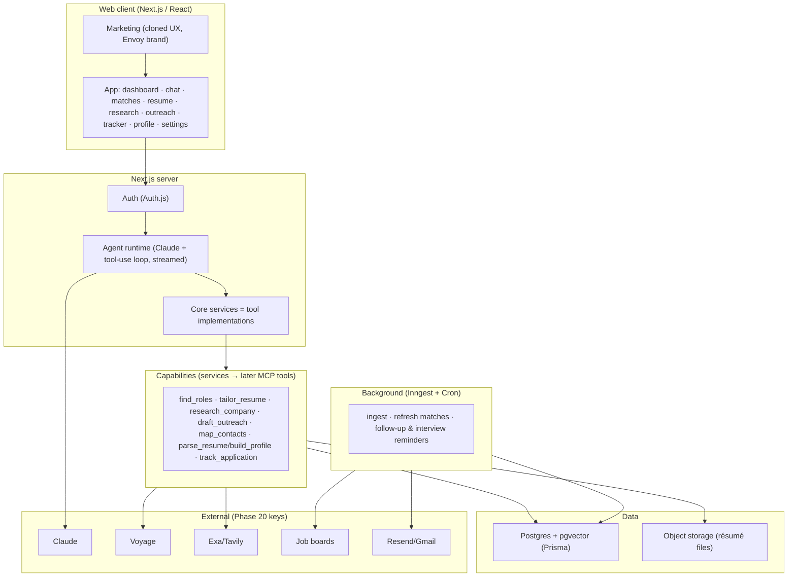

# ENVOY_CONTEXT.md — architecture & system spec

The master technical reference for Envoy. Pairs with `ENVOY_PRODUCT.md` (what), `ENVOY_UI.md` (look), `ENVOY_GUARDRAILS.md` (rules), `ENVOY_BUILD_PLAN.md` (order).

## What Envoy is
A candidate-side career copilot. A job-seeker drops their résumé + LinkedIn + preferences; Envoy finds the roles worth their time and explains why each fits, maps who to reach at each company and drafts outreach that sounds like them, tailors their résumé/cover letter per posting, researches the company and interviewers before each round, and tracks every application — proactively nudging along the way. A conversational agent ("Envoy") with tools drives it; structured views are the durable artifacts it produces.

## Architecture



**Request flow:** browser → Next.js (auth + zod validation) → agent runtime runs a Claude tool-use loop → tools (the core services) read/write Postgres and call external APIs → results stream back to chat and write to the views. Inngest ingests jobs on a schedule, refreshes matches, and fires reminders.

## Tech stack (committed)
TypeScript end to end. Next.js 15 (App Router) + React 19 · Tailwind + shadcn-style components + lucide-react · Vercel AI SDK (`ai`) + `@ai-sdk/anthropic` for streaming + tool calls · Anthropic Claude (agent + generation) · Postgres (Neon/Supabase) + Prisma + pgvector · Voyage embeddings (alt: OpenAI) · Exa web research (alt: Tavily) · Greenhouse/Lever/Ashby public board APIs + Adzuna for jobs · Auth.js (Google + email) · Inngest for cron/workflows · R2/Supabase Storage for résumé files · Resend (+ optional Gmail OAuth) for approved sends · Zod validation · Vitest + Playwright · Vercel deploy.

## Mock-first contract
Every external dependency has: an **interface**, a **mock implementation** (deterministic fixtures), and — added in Phase 20 — a **real adapter**. A single `USE_MOCKS` env flag (overridable per provider) selects which. The whole product runs and all tests pass with `USE_MOCKS=true` and no secrets.

## Core capabilities → tool contracts (see Phase 6)
Each is a plain service function with a Zod-validated input/output contract, callable by the agent now and wrappable as an MCP tool later.

```ts
parse_resume({ fileId }) -> { rawText, structured }
build_profile({ userId, structured, preferences }) -> { profileId, summary }
find_roles({ profileId, query?, filters?, limit? }) -> { matches: [{ jobId, score, reasoning, gaps }] }
tailor_resume({ profileId, jobId }) -> { resumeDocId, coverLetterDocId, diffSummary, changes }
research_company({ company, jobId?, people? }) -> { dossier, likelyQuestions, questionsToAsk, sources }
map_contacts({ profileId, jobId }) -> { targets: [{ archetype, rationale, namedPerson? }] }
draft_outreach({ profileId, jobId, target, channel }) -> { drafts: [{ tone, subject?, body }], rationale } // DRAFT ONLY — never sends
track_application({ userId, jobId, stage, note?, nextAction? }) -> { applicationId }
```
Guardrails baked into implementations: `draft_outreach`/`tailor_resume` return content, never transmit; `find_roles` reads only the ingested ToS-compliant store; `map_contacts`/`research_company` use public web data only and never return harvested private contact info. (Full rules in `ENVOY_GUARDRAILS.md`.)

## Data model
See `schema.prisma` (authoritative): `User`, `CandidateProfile` (+ `vector(1024)` embedding), `ResumeFile`, `Company`, `Job` (+ embedding), `Match`, `Application`, `Outreach`, `Settings`. Enable pgvector via migration (`CREATE EXTENSION IF NOT EXISTS vector;`) and index job/profile vectors.

## Matching (Phase 10)
Ingest jobs → embed descriptions (Voyage) → embed profile → pgvector similarity retrieve (filtered by hard prefs) → Claude rerank for fit + plain-English reasoning + gaps → persist as `Match`. Two-stage retrieve-then-rerank keeps cost down and quality up. The hard part is data + ranking quality, not the pipeline — see evals.

## OpenSwarm integration (follow-on)
The services are the seam: wrap them as MCP tools (`src/mcp/`), expose the **tracker** as the View and the cron jobs as the **Cron** surface. `draft_outreach` stays draft-only over MCP; sends remain approval-gated in the host. Web-first now; this is post-1.0.

## Files in this folder (delivered flat) → target structure
This spec folder is intentionally **flat**: every file sits at the top level, no subfolders — `CLAUDE.md`, `README.md`, `PROMPT.md`, the `ENVOY_*.md` docs, `landing.html`, `schema.prisma`, `ci.yml`, and the config files (`package.json`, `tsconfig.json`, `next.config.mjs`, `tailwind.config.ts`, `postcss.config.mjs`, `.eslintrc.json`, `.prettierrc`, `.gitignore`, `.env.example`, `docker-compose.yml`).

In **Phase 1**, Claude Code scaffolds the standard repo tree and moves these into place:
- `schema.prisma` → `prisma/`
- `landing.html` → `design/`
- `ci.yml` → `.github/workflows/`
- app code under `src/`: `app/` (`(marketing)`, `(app)`, `api`), `components/`, `lib/` (`agent/`, `matching/`, `llm.ts`, `embeddings.ts`, `search.ts`, `env.ts`), `server/` (`ingestion/`, `services/`, `resume/`, `db.ts`), `inngest/`, and `mcp/` (follow-on); plus `evals/`.

## Environment
See `.env.example`. `USE_MOCKS=true` and no keys are needed through Phase 19. Phase 20 adds: `ANTHROPIC_API_KEY`, `VOYAGE_API_KEY`, `EXA_API_KEY`/`TAVILY_API_KEY`, `ADZUNA_APP_ID`/`ADZUNA_APP_KEY`, `GOOGLE_CLIENT_ID`/`SECRET`, `R2_*`, `RESEND_API_KEY`/`GMAIL_*`, `INNGEST_*`, and a production `DATABASE_URL`.
